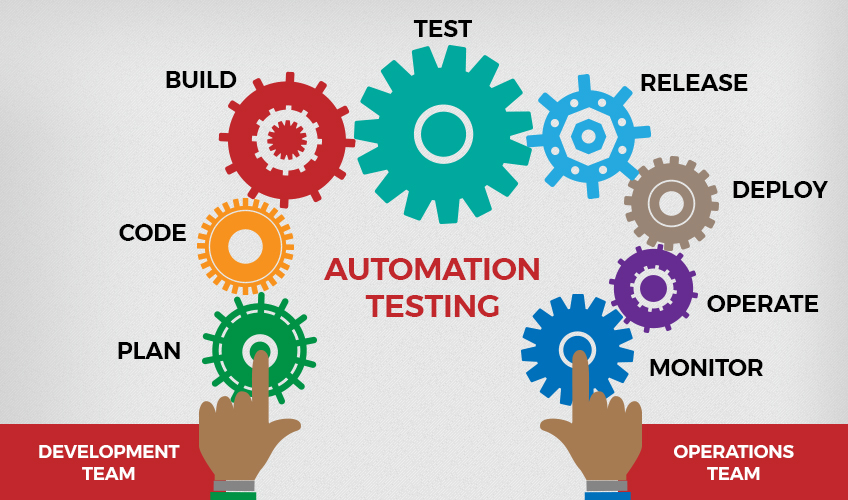
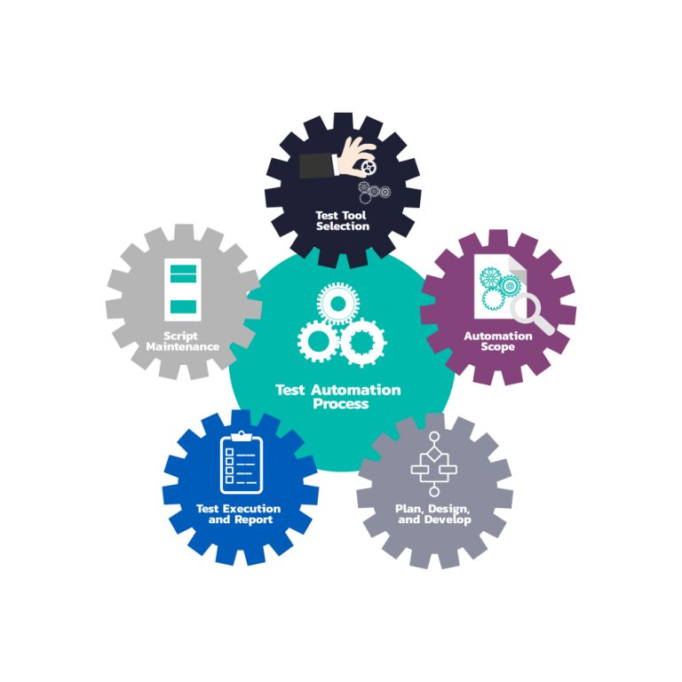

# What Is Automation Testing ? 

Automation testing is a Software testing technique to test and compare the actual outcome with the expected outcome. 
This can be achieved by writing test scripts or using any automation testing tool. Test automation is used to automate repetitive tasks
and other testing tasks which are difficult to perform manually.

## Why Automation ? 
The goal of automation is to reduce the number of test cases to be run manually and not eliminate 
manual testing all together. For a developer automated testing is important due to these reasons: 

* Manual testing of all work flows, fields and negative scenarios is time and cost consuming

* It is difficult to test for multilingual sites manually 

* Automation does not require human intervention. You can run automated test unattended

* Automation increases speed of test execution and test coverage  

* Manual testing can become boring and lead to errors in work

## When are you likely to use automation ? 

* For test cases that need to be executed repeatedly

* For test cases that are very tedious or difficult to perform manually

* Test cases that can be time consuming 

* Business critical test cases that are of higher risks 
